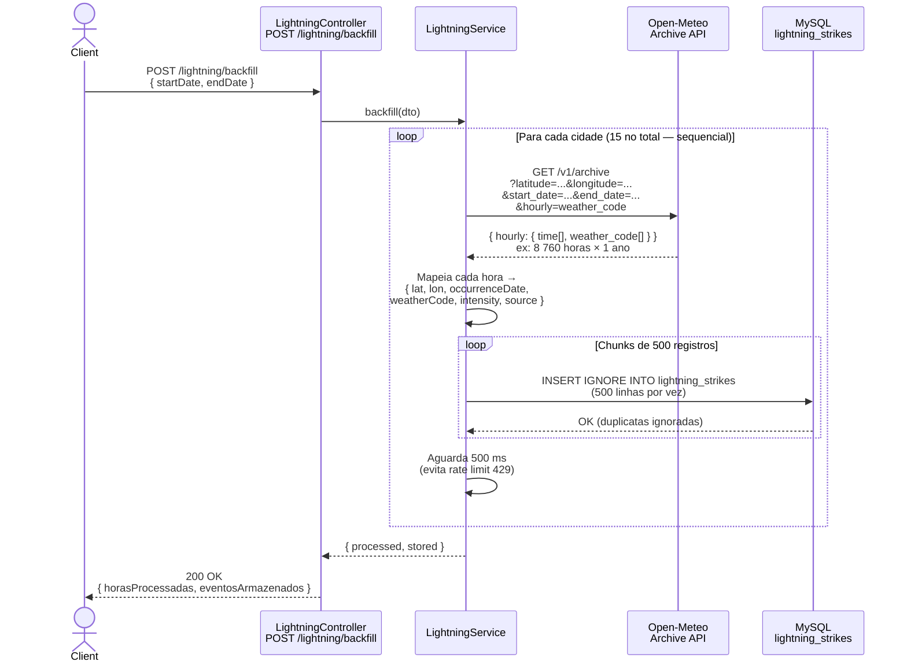

# Fluxo de Backfill — Backend × Open-Meteo



## Detalhes do fluxo

| Etapa | Detalhe |
|-------|---------|
| **Fonte** | `archive-api.open-meteo.com` — dados ERA5, gratuito, sem chave de API |
| **Granularidade** | Horária — 1 registro por cidade por hora |
| **Cidades monitoradas** | 15 pontos distribuídos pelo Brasil |
| **Códigos salvos** | Todos os códigos WMO (0–99), sem filtro — frontend interpreta |
| **Intensidade (kA)** | Preenchida apenas para códigos de trovoada (95, 96, 99) |
| **Deduplicação** | `INSERT IGNORE` + índice único `(latitude, longitude, occurrenceDate)` |
| **Proteção 429** | Cidades processadas sequencialmente com 500 ms de intervalo |
| **Proteção timeout** | Inserções em chunks de 500 linhas — evita conexão longa com MySQL |
| **Re-execução** | Segura — registros existentes são ignorados, nenhum dado é sobrescrito |
```
